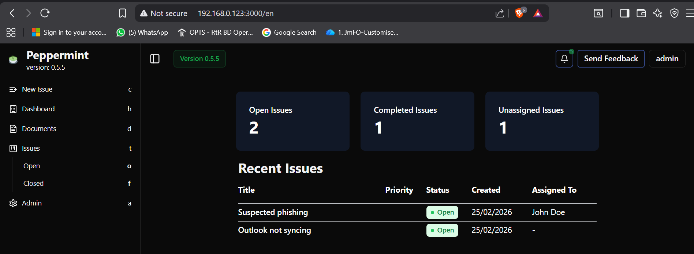
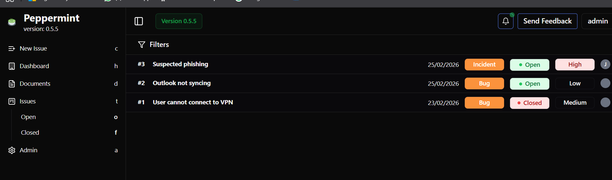
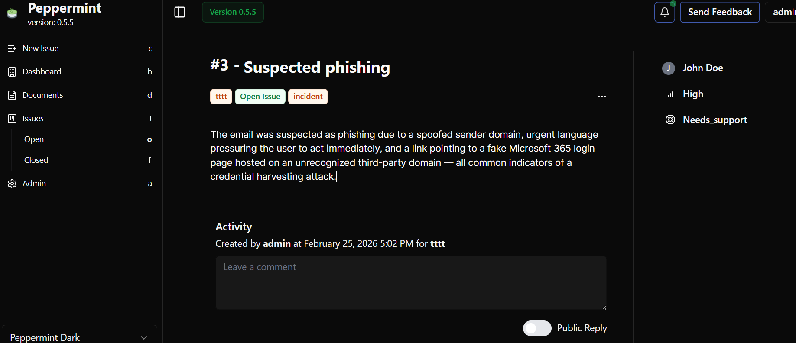
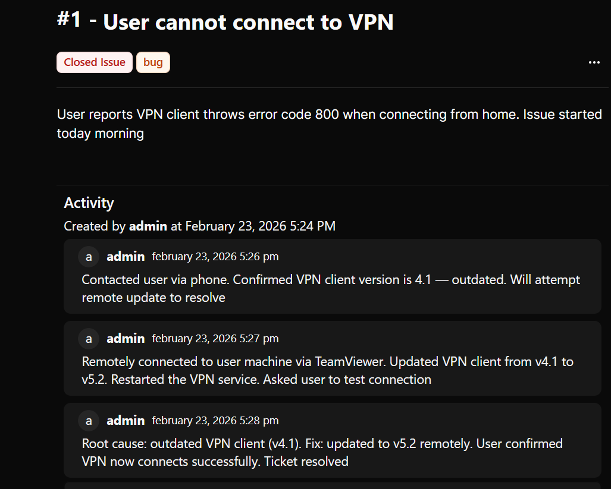
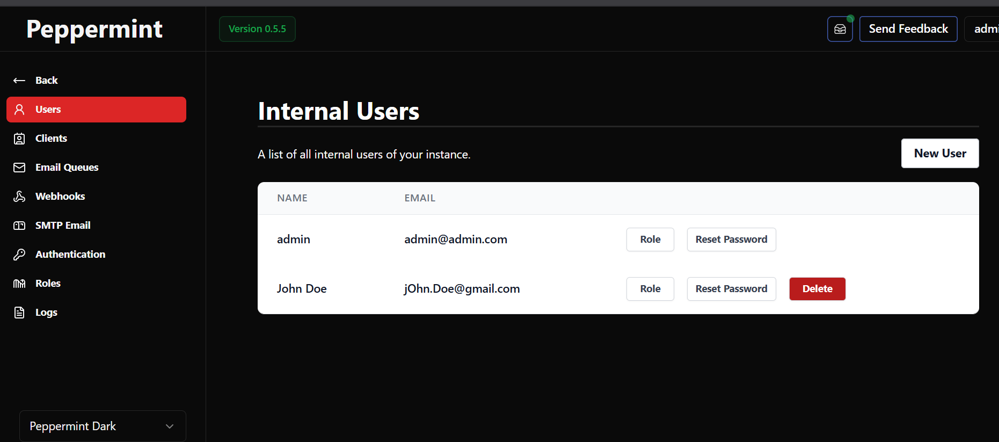
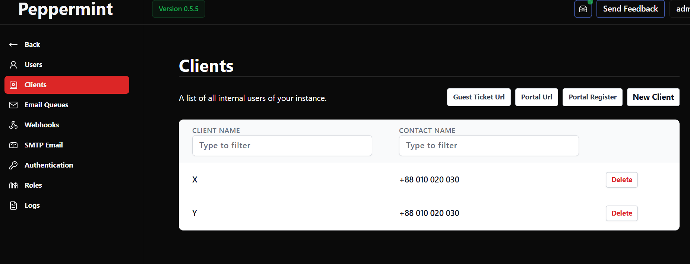

# IT Helpdesk Ticketing System Simulation using Peppermint

## Table of Contents
- [Overview](#overview)
- [Tools & Environment](#tools--environment)
- [Ticket Lifecycle Management](#ticket-lifecycle-management)
- [Incident Categorization & Prioritization](#incident-categorization--prioritization)
- [Internal User Management](#internal-user-management)
- [Client Database Management](#client-database-management)
- [What I Learned](#what-i-learned)

---

## Overview

This project simulates a real-world IT helpdesk environment using Peppermint, an open-source ticketing system. The goal was to practice core helpdesk workflows including ticket lifecycle management, incident categorization and prioritization, user and client management, and role-based access control — skills directly applicable to Tier 1 and Tier 2 IT support roles.

<!-- 📸 *Screenshot: `peppermint-dashboard-overview.png` — shows the main Peppermint dashboard with tickets visible* -->


---

## Tools & Environment

| Component | Details |
|---|---|
| Ticketing System | Peppermint (self-hosted) |
| Host Machine | [your OS here, e.g., Windows 11 / Ubuntu] |
| Deployment | [e.g., Docker / Local install] |
| Browser | Chrome / Firefox |


---

## Ticket Lifecycle Management

Each ticket was handled through a complete lifecycle from creation to closure. The following stages were followed for every ticket:
```
Open → In Progress → Resolved → Closed
```

For every ticket I documented:
- The reported issue and its description
- Initial response and investigation steps
- Troubleshooting actions taken
- Final resolution note before closing

<!--  📸 *Screenshot: `ticket-list-all-tickets.png` — shows full list of all created tickets with their status and priority visible*
 📸 *Screenshot: `ticket-detail-open.png` — shows a freshly created ticket in Open status with title, description, and priority filled in*
 📸 *Screenshot: `ticket-internal-notes.png` — shows the internal notes/comments section of a ticket with documented troubleshooting steps* -->







---

## Incident Categorization & Prioritization

Tickets were created across multiple categories to simulate a realistic helpdesk queue. Each ticket was assigned a priority level based on business impact and urgency using a P1–P4 framework:

| Priority | Level | Example Ticket Created |
|---|---|---|
| P1 | Critical | Phishing email reported across accounting dept |
| P2 | High | User cannot connect to VPN |
| P4 | Low | Outlook not syncing |


---

## Internal User Management

A new internal user was created within Peppermint to simulate a multi-user helpdesk team environment. This included:

- Creating the user account with their name and credentials
- Assigning the user a defined role (e.g., Admin, Technician, or User)
- Simulating ticket assignment to that user

This reflects how real helpdesk teams manage technician accounts and control what each person can access or do inside the system.

<!--  📸 *Screenshot: `internal-user-creation-form.png` — shows the user creation form filled in with name, email, and credentials*

 📸 *Screenshot: `internal-user-role-assigned.png` — shows the role dropdown assigned to the internal user (e.g., Admin / Technician)*

 📸 *Screenshot: `internal-user-list.png` — shows the user list page confirming the new user exists in the system* -->



 

---

## Client Database Management

Client information was added to Peppermint's client database to simulate an MSP (Managed Service Provider) or enterprise environment where tickets are tied to specific clients or departments. This included adding client details such as name and contact information, and associating that client record within the system.

<!-- 📸 *Screenshot: `client-database-list.png` — shows the client list page with the added client entry visible*-->



---

## What I Learned

**Ticket Lifecycle** — I learned that every ticket needs a clear paper trail. Logging each step — from the first response to the final resolution — is not just good practice, it protects the technician and helps teammates understand what was done if the ticket gets escalated or reopened.

**Prioritization Judgment** — Deciding whether something is a P1 or P3 is not always obvious. I learned to think in terms of business impact: how many users are affected, is a critical system down, and does a workaround exist? These questions drive the right priority call.

**Categorization** — Organizing tickets by type (hardware, software, network, security, etc.) showed me how categorization helps teams identify trends — for example, if ten tickets come in about the same software, that is a problem worth escalating rather than solving one by one.

**User & Role Management** — Creating internal users and assigning roles taught me how access control works in a helpdesk platform. Not every team member should have admin rights, and role separation keeps the system secure and organized.

**Client Management** — Adding client records showed me how MSPs and larger IT teams track which tickets belong to which organization or department, making reporting and accountability cleaner.

**Documentation Discipline** — The biggest lesson overall was that in IT support, if it is not written down, it did not happen. Every note I added to a ticket reinforced the habit of documenting clearly and professionally, which is a skill every hiring manager looks for in helpdesk candidates.

---

*This project was completed as part of a home lab setup to build practical IT support skills ahead of entering the field.*
